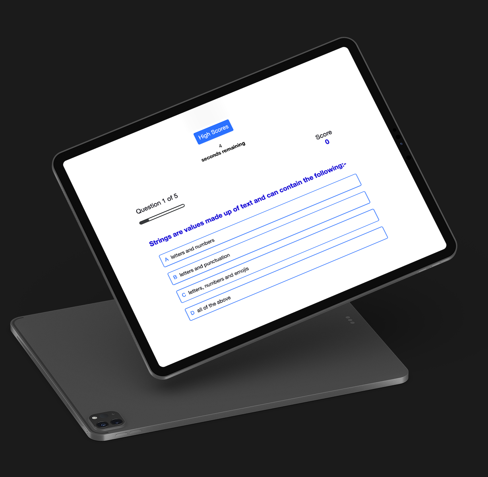

# JAVASCRIPT QUIZ APP
## **Deployed web address**
https://kyunginlee.github.io/04-Code-Quiz/
 

## **Project Description**

A multiple choice quiz which cycles through a predetermined number (5) of questions and on cycling through all available questions, ends the quiz and gives the user the option to save their score. Users are able to see their progress via a progress bar and will be racing against a countdown timer which will also bring the quiz to an end when 0 time remains. 
 

## **Functionality / Technologies Used**

When the user clicks the start button, a timer starts and they are presented with the first question. The progress bar and text above will indicate how far the user has progressed. When the user answers a question incorrectly, 2 seconds are subtracted from the clock, and when the user answers a question correctly, 4 seconds are added to the timer.
 
When the end of the quiz is reached, or the timer has 0 seconds remaining, the game will end and take the user to the score page, which will also provide the user the option to play again.

1) HTML / CSS / JAVASCRIPT

 

## **Installation and usage instructions**

1) Head to https://kyunginlee.github.io/04-Code-Quiz/ and click on 'start'. 

2) Choose 1 answer for the question, until all 5 questions have been answered. 

3) Save score by typing a username and clicking 'save' or play again, or return to home screen.

## **Future Development**

Incorporate audio/visual feedback based on target audience

## **Resources**
1) How to Make a Quiz App using HTML CSS Javascript - Vanilla Javascript Project for Beginners Tutorial https://www.youtube.com/watch?v=f4fB9Xg2JEY
